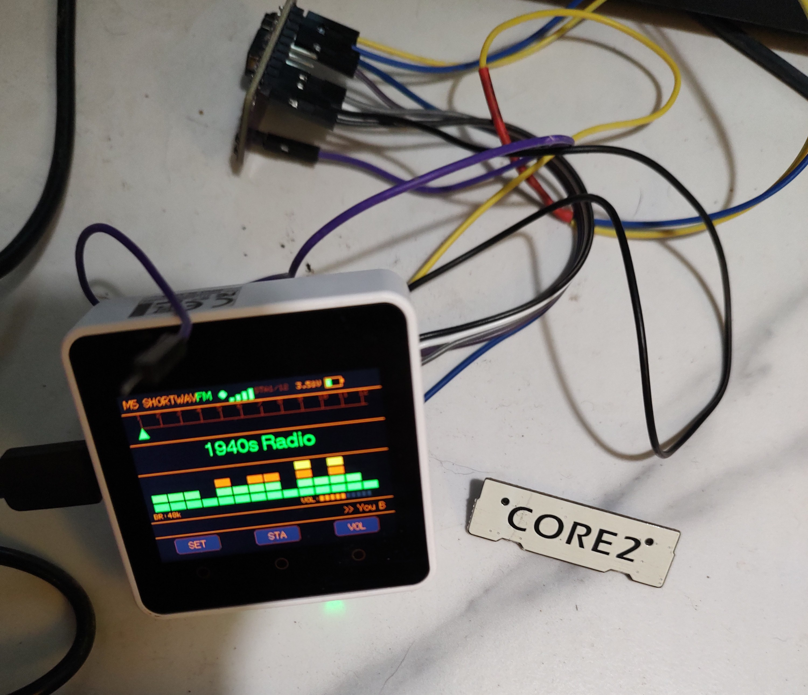
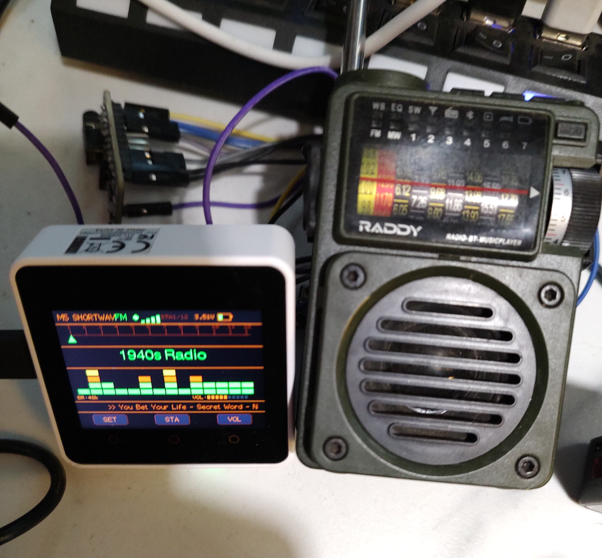

# M5Core2Radio 📻

WiFi OTR Internet Radio for **M5Stack Core2** — a port of [M5RadioStream](../M5RadioStream) (Core1 Basic) upgraded with **16-bit I2S audio** and an optional **SI4713 FM modulator** so the stream can be broadcast to any FM radio in the room.

Original concept: **[winRadio by Volos Projects](https://github.com/VolosR/WaveshareRadioStream)**

---

## Photos

### v1.3 — Core2 + CJMCU-4713 SI4713 FM Modulator wired up

*Retro amber "M5 SHORTWAVE FM" skin — 1940s Radio playing, SI4713 module connected via jumper wires to Port A (I2C) and Port B (DAC audio)*

### FM broadcast in action — received on a Raddy shortwave radio

*The Core2 streams OTR internet radio and re-broadcasts it over FM. The Raddy is tuned to the SI4713's frequency and picking it up live. Ticker: "You Bet Your Life - Secret Word" (Groucho Marx, 1947)*

---

## Key Upgrade Over Core1 Version

| | Core1 Basic | **Core2** |
|---|---|---|
| Audio output | 8-bit internal DAC | **16-bit I2S → NS4168 amp** |
| Background hiss | Constant (hardware floor) | **Dramatically reduced** |
| Touch input | Physical buttons only | **Capacitive touch + physical** |
| Haptic feedback | None | **Vibration motor on every tap** |
| PSRAM | None | **4MB** |
| FM broadcast | None | **Optional SI4713 modulator** |

---

## Controls

Both the **on-screen touch footer** and **physical virtual buttons** work:

| Touch Zone | Button | Normal Mode | Settings Mode |
|---|---|---|---|
| [SET] | BtnA (short) | Open sound settings | — |
| — | **BtnA (hold 1s)** | **Toggle FM ↔ Speaker output** | — |
| [STA] | BtnB | Cycle station (1.5s debounce) | Select next parameter |
| [VOL] | BtnC (short) | Cycle volume 0–10 (0=mute) | Increase value |
| — | **BtnC (hold 1s)** | **Toggle screen on/off** | — |
| [BACK] | BtnA | — | Exit settings |

> **FM badge** in header: green = FM mode active, grey = speaker mode active.
> RDS song title updates automatically on the receiving radio as each show changes.

---

## Hardware

| Component | Details |
|-----------|---------|
| Board | M5Stack Core2 |
| MCU | ESP32 (dual-core, 240 MHz) |
| Display | ILI9341 320×240, capacitive touch |
| Audio amp | I2S → NS4168 (BCK=GPIO12, LRC=GPIO0, DOUT=GPIO2) |
| Speaker | 1W, 8Ω onboard |
| PSRAM | 4MB |
| FM module | CJMCU-4713 SI4713 *(optional)* |

---

## Optional SI4713 FM Modulator Wiring

The SI4713 is **fully optional** — the firmware detects it on I2C at boot and enables FM features automatically if present.

| CJMCU-4713 Pin | Core2 Connection | Notes |
|---|---|---|
| VIN | 5V | Module has onboard 3.3V regulator |
| GND | GND | |
| SDA | GPIO21 (Port A) | |
| SCL | GPIO22 (Port A) | |
| RST | GPIO13 (expansion) | Required — library toggles it |
| LIN | GPIO26 (Port B) | ESP32 DAC2 analog audio |
| RIN | GPIO26 (Port B) | Same pin — mono |
| CS/SEN | Module's own 3V0 pin | Sets I2C address to 0x63 |
| ANT | ~2 inch wire (recommended) | See FCC disclaimer below — shorter is safer |
| GP1, GP2, 3V0 | Unconnected | Not needed |

**FM frequency** is set in the sound settings menu (FM MHz) and persists in NVS across reboots.

---

## Stations (ROKiT Radio Network — OTR classics, 48 kbps MP3)

| # | Station | Highlights |
|---|---|---|
| 1 | 1940s Radio | Big band, wartime era |
| 2 | American Comedy | Fibber McGee & Molly, Jack Benny, You Bet Your Life |
| 3 | American Classics | Drama anthology |
| 4 | Jazz Central | Swing & jazz |
| 5 | Comedy Gold | Burns & Allen, Red Skelton |
| 6 | Mystery Radio | Suspense, Inner Sanctum |
| 7 | Crime & Suspense | Dragnet, Philip Marlowe |
| 8 | Crime Radio | Sam Spade, Boston Blackie |
| 9 | Adventure Stories | The Lone Ranger, Zorro |
| 10 | Drama Radio | Lux Radio Theatre |
| 11 | Nostalgia Lane | Mixed OTR variety |
| 12 | Science Fiction | X Minus One, Dimension X |

---

## Build & Flash

```bash
# Build and upload directly
pio run --target upload

# Serial monitor
pio device monitor --baud 115200
```

### Flash with M5Burner
Use **`M5Core2Radio-v1.3-MERGED.bin`** — flash to offset `0x0`.

---

## First Boot / WiFi Setup

On first boot (or hold **BtnA** during the 3-second splash), a captive portal opens:

1. Connect phone/PC to WiFi network **`M5Radio_Setup`**
2. Open browser → `192.168.4.1`
3. Enter your 2.4 GHz WiFi credentials → Save

Credentials are stored in NVS and survive power cycles.

---

## Planned Features

- **FM passthrough / aux input mode** — stop the internet stream but leave the SI4713 modulator active, allowing an external MP3 player or audio source to be plugged in and broadcast over FM. Turns the Core2 into a general-purpose FM transmitter.

---

## ⚠️ FCC Disclaimer — FM Transmission Legal Notice

> **Read this before connecting an antenna to the SI4713 module.**

### Legal Status

In the United States, low-power FM transmission is governed by **47 CFR Part 15, Subpart D** (unlicensed intentional radiators). Under these rules:

- Transmission is permitted **without a license** only when the signal is so weak it cannot cause interference to licensed stations.
- The FCC does **not** define a specific wattage or distance limit — it defines an **interference threshold**. If your signal reaches a licensed station's coverage area and causes interference, you are in violation regardless of intent.
- The FCC **actively enforces** FM interference complaints. They use direction-finding equipment to locate illegal transmitters. Fines start in the thousands of dollars and equipment can be confiscated.

### Antenna Guidance

Antenna length dramatically affects range:

| Antenna | Approximate range | Risk level |
|---|---|---|
| No antenna (PCB trace only) | < 3 ft | Minimal |
| **~2 inch wire (recommended)** | **~10–15 ft** | **Safe for personal use** |
| 12 inch wire | ~30–50 ft | Use caution |
| 75 cm / 30 inch (λ/4) | ~80–150 ft | High — may leave your property |
| Full dipole or amplified | 300+ ft | Likely illegal — do not use |

**Recommendation:** Use a stub of 1–2 inches of wire. This is sufficient to fill a single room and keeps the signal well within your home. The SI4713 at full power with a proper quarter-wave antenna can reach 80+ feet even under non-ideal conditions — confirmed during testing of this project.

### Best Practices

1. **Keep the signal on your own property.** The signal should not be receivable from a public road, a neighbor's property, or anywhere you do not own or control.
2. **Choose an unused frequency.** Use the settings menu to pick an FM frequency with no existing licensed station in your area. Scan your local FM band before transmitting.
3. **Use the shortest practical antenna.** 2 inches is recommended. Longer = more range = more legal risk.
4. **Do not rebroadcast copyrighted content** beyond your own private use. The stations included in this firmware are Old Time Radio (public domain) content intended for personal, private listening only.
5. **This firmware is provided for educational and personal hobbyist use only.** The authors accept no responsibility for any regulatory violations resulting from its use.

> The FCC takes FM interference seriously. They will find you. Keep it short, keep it local, keep it legal.

---

## Credits

- **Original project:** [winRadio by Volos Projects](https://github.com/VolosR/WaveshareRadioStream)
- **Core2 port & skin:** CoreyMillia / GitHub Copilot — 2026
